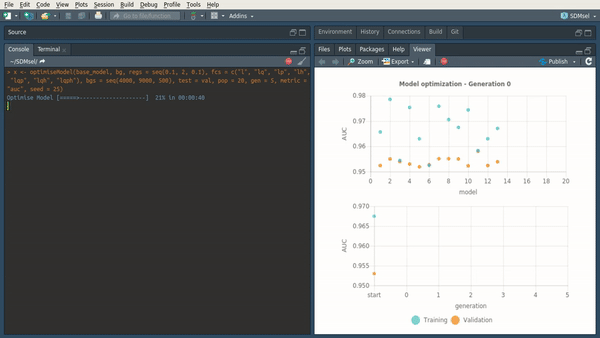

---
output:
  github_document
---

<!-- README.md is generated from README.Rmd. Please edit that file -->

```{r, echo = FALSE}
knitr::opts_chunk$set(
  collapse = TRUE,
  comment = "#>",
  fig.path = "docs/reference/figures/README-"
)
```

# SDMtune 

**SDMtune** provides a framework that facilitates preparing data for analysis, train and evaluate models (at the moment it implements MaxEnt and Maxnet models). It also includes utilities to display results and functions for variable selection and model tuning.
**SDMtune** uses its own script to predict MaxEnt models that performs much faster for large datasets than native predictions made using Java software. This reduces considerably the computation time when tuning the model, especially when optimizing the **AICc**. 

## Installation

You can get the latest stable version from CRAN:

```{r CRAN-installation, eval=F}
install.packages("SDMtune")
```

or the latest development version from github:

```{r gh-installation, eval = FALSE}
devtools::install_github("sgvignali/SDMtune")
```

## Real time charts

Real time charts displaying the training and validation metrics are displayed in the RStudio viewer pane during the execution of the tuning and variable selection functions.

<div style="text-align: center"></div>
