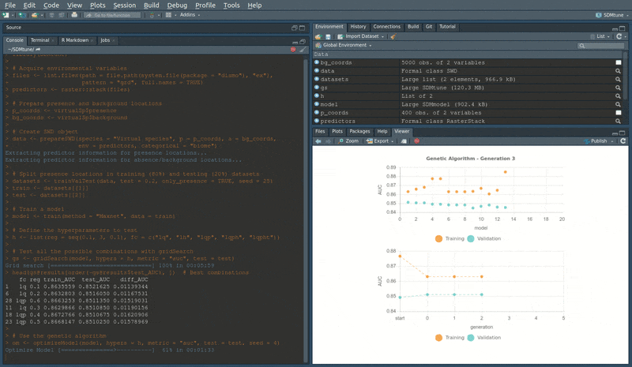

---
output:
  github_document
---

<!-- README.md is generated from README.Rmd. Please edit that file -->

```{r, echo = FALSE}
knitr::opts_chunk$set(
  collapse = TRUE,
  comment = "#>",
  fig.path = "docs/reference/figures/README-"
)
```

# SDMtune 

[](https://travis-ci.org/sgvignali/SDMtune)
[](https://codecov.io/github/sgvignali/SDMtune?branch=master)
[](https://cran.r-project.org/package=SDMtune)

**SDMtune** provides a user-friendly framework that enables the training and the evaluation of species distribution models (SDMs). The package implements functions for data driven variable selection and model tuning and includes numerous utilities to display the results. All the functions used to select variables or to tune model hyperparameters have an interactive real-time chart displayed in the RStudio viewer pane during their execution. SDMtune uses its own script to predict MaxEnt models, resulting in much faster predictions for large datasets compared to native predictions from the use of the Java software. This reduces considerably the computation time when tuning the model using the AICc. At the moment only the Maximum Entropy method is available using the Java implementation through the “dismo” package and the R implementation through the “maxnet” package. Visit the [package website](https://sgvignali.github.io/SDMtune/) to learn how to use **SDMtune**.

## Installation

You can install the latest development version from GitHub:

```{r gh-installation, eval = FALSE}
devtools::install_github("sgvignali/SDMtune")
```

## Real-time charts

Real-time charts displaying the training and the validation metrics are displayed in the RStudio viewer pane during the execution of the tuning and variable selection functions.

<div style="text-align: center"></div>
