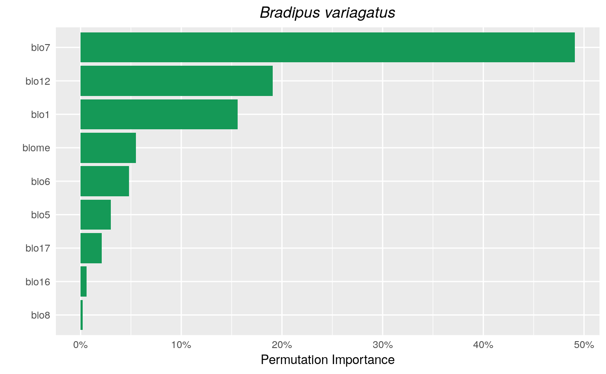
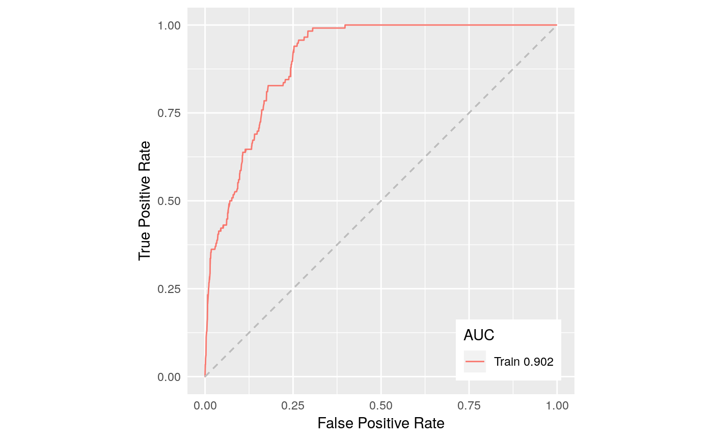
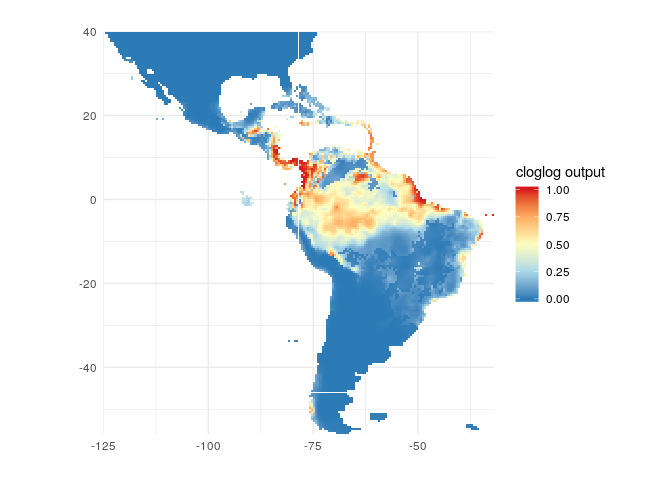

<!-- README.md is generated from README.Rmd. Please edit that file -->
SDMsel 
=======================================================

SDMsel (Species Distribution Model selection) provides a framework that facilitates user in preparing data for analysis, train and evaluate models. It also implements functions for data driven variable selection and model tuning and includes some utilities to display results (at the moment it implements only MaxEnt models).

Installation
------------

You can get the latest stable version from CRAN:

``` r
install.packages("SDMsel")
```

or latest development version from github:

``` r
devtools::install_github("sgvignali/SDMsel")
```

Example
-------

Load required packages:

``` r
library(SDMsel)
#> Loading required package: zeallot
#> Loading required package: ggplot2
#>  ________________________________________
#> |   ____   ____   __  __             _   |
#> |  / ___| |  _ \ |  \/  | ___   ___ | |  |
#> |  \___ \ | | | || |\/| |/ __| / _ \| |  |
#> |   ___) || |_| || |  | |\__ \|  __/| |  |
#> |  |____/ |____/ |_|  |_||___/ \___||_|  |
#> |________________________________________|
#> 
library(dismo)
#> Loading required package: raster
#> Loading required package: sp
```

Obtain data for analysis, we use the dataset provided by `dismo`package:

``` r
files <- list.files(path = paste(system.file(package = "dismo"), "/ex", sep = ""), pattern = "grd", full.names = T)
predictors <- stack(files)
file <- paste(system.file(package = "dismo"), "/ex/bradypus.csv", sep = "")
bradypus <- read.table(file, header = TRUE, sep = ",")
train_coords <- bradypus[, 2:3]
set.seed(25)
bg_coords <- randomPoints(predictors, 5000)  # Extract random points
```

Prepare the data for the analisys with `SDMsel`:

``` r
train <- prepareSWD(species = "Bradipus variagatus", coords = train_coords, env = predictors, categoricals = "biome")
#> Extracting environmental condition for Bradipus variagatus...
bg <- prepareSWD(species = "Bradipus variagatus", coords = bg_coords, env = predictors, categoricals = "biome")
#> Extracting environmental condition for Bradipus variagatus...
#> Warning: 5 locations are NA for some environmental variables, they will be discard!
```

Train a MaxEnt model:

``` r
model <- trainMaxent(presence = train, bg = bg, rm = 1, fc = "lqp", type = "cloglog", iter = 500)
#> Loading required namespace: rJava
```

Plot variable importance:

``` r
plotVarImp(model, type = "permutation", color = "#159957")
```



plot ROC curve:

``` r
plotROC(model)
```



Make prediction:

``` r
pred <- predict(model, predictors)
```

Plot prediction:

``` r
plotPred(pred, colorramp = c("#2c7bb6", "#abd9e9", "#ffffbf", "#fdae61", "#d7191c"), lt = "cloglog output")
```


