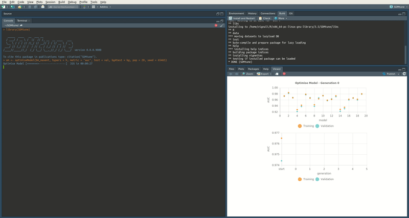
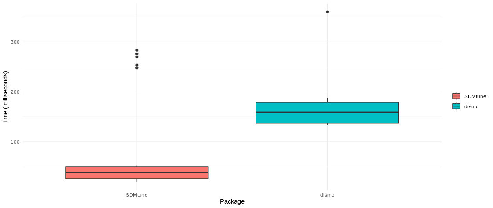

<!-- README.md is generated from README.Rmd. Please edit that file -->

# SDMtune 

<!-- badges: start -->

[](https://github.com/ConsBiol-unibern/SDMtune/actions)
[](https://cran.r-project.org/package=SDMtune)
[](https://www.r-pkg.org/pkg/SDMtune)
[](https://codecov.io/github/ConsBiol-unibern/SDMtune?branch=master)
[](https://consbiol-unibern.github.io/SDMtune/CODE_OF_CONDUCT.html)
<!-- badges: end -->

**SDMtune** provides a user-friendly framework that enables the training
and the evaluation of species distribution models (SDMs). The package
implements functions for data driven variable selection and model tuning
and includes numerous utilities to display the results. All the
functions used to select variables or to tune model hyperparameters have
an interactive real-time chart displayed in the RStudio viewer pane
during their execution. Visit the [package
website](https://consbiol-unibern.github.io/SDMtune/) and learn how to
use **SDMtune** starting from the first article [Prepare data for the
analysis](https://consbiol-unibern.github.io/SDMtune/articles/articles/prepare_data.html).

## Installation

You can install the latest release version from CRAN:

``` r
install.packages("SDMtune")
```

Or the development version from GitHub:

``` r
devtools::install_github("ConsBiol-unibern/SDMtune")
```

## Hyperparameters tuning & real-time charts

**SDMtune** implements three functions for hyperparameters tuning:

-   `gridSearch`: runs all the possible combinations of predefined
    hyperparameters’ values;
-   `randomSearch`: randomly selects a fraction of the possible
    combinations of predefined hyperparameters’ values;
-   `optimizeModel`: uses a *genetic algorithm* that aims to optimize
    the given evaluation metric by combining the predefined
    hyperparameters’ values.

When the amount of hyperparameters’ combinations is high, the
computation time necessary to train all the defined models could be very
long. The function `optimizeModel` offers a valid alternative that
reduces computation time thanks to an implemented *genetic algorithm*.
This function seeks the best combination of hyperparameters reaching a
near optimal or optimal solution in a reduced amount of time compared to
`gridSearch`. The following code shows an example using a simulated
dataset. First a model is trained using the **Maxnet** algorithm
implemented in the `maxnet` package with default hyperparameters’
values. After the model is trained, both the `gridSearch` and
`optimizeModel` functions are executed to compare the execution time and
model performance evaluated with the AUC metric. If the following code
is not clear, please check the articles in the
[website](https://consbiol-unibern.github.io/SDMtune/).

``` r
library(SDMtune)

# Acquire environmental variables
files <- list.files(path = file.path(system.file(package = "dismo"), "ex"),
                    pattern = "grd", full.names = TRUE)
predictors <- raster::stack(files)

# Prepare presence and background locations
p_coords <- virtualSp$presence
bg_coords <- virtualSp$background

# Create SWD object
data <- prepareSWD(species = "Virtual species", p = p_coords, a = bg_coords,
                   env = predictors, categorical = "biome")

# Split presence locations in training (80%) and testing (20%) datasets
datasets <- trainValTest(data, test = 0.2, only_presence = TRUE, seed = 25)
train <- datasets[[1]]
test <- datasets[[2]]

# Train a Maxnet model
model <- train(method = "Maxnet", data = train)

# Define the hyperparameters to test
h <- list(reg = seq(0.1, 3, 0.1), fc = c("lq", "lh", "lqp", "lqph", "lqpht"))

# Test all the possible combinations with gridSearch
gs <- gridSearch(model, hypers = h, metric = "auc", test = test)
head(gs@results[order(-gs@results$test_AUC), ])  # Best combinations

# Use the genetic algorithm instead with optimizeModel
om <- optimizeModel(model, hypers = h, metric = "auc", test = test, seed = 4)
head(om@results)  # Best combinations
```

During the execution of “tuning” and “variable selection” functions,
real-time charts displaying training and validation metrics are
displayed in the RStudio viewer pane (below is a screencast of the
previous executed `optimizeModel` function).

<div style="text-align: center">



</div>

## Speed test

In the following example we train a **Maxent** model:
<!-- The next code is not evaluated because MaxEnt jar file is not bundled in the package and Github will not execute it! -->
<!-- the plot is saved as an image in the man/figures folder -->

``` r
# Train a Maxent model
sdmtune_model <- train(method = "Maxent", data = data)
```

We compare the execution time of the `predict` function between
**SDMtune** that uses its own algorithm and **dismo** (Hijmans et al.
2017) that calls the MaxEnt Java software (Steven J. Phillips, Anderson,
and Schapire 2006). We first convert the object `sdmtune_model` in a
object that is accepted by **dismo**:

``` r
maxent_model <- SDMmodel2MaxEnt(sdmtune_model)
```

Next is a function used below to test if the results are equal, with a
tolerance of `1e-7`:

``` r
my_check <- function(values) {
  return(all.equal(values[[1]], values[[2]], tolerance = 1e-7))
}
```

Now we test the execution time using the **microbenckmark** package:

``` r
bench <- microbenchmark::microbenchmark(
  SDMtune = predict(sdmtune_model, data = data, type = "cloglog"),
  dismo = predict(maxent_model, data@data),
  check = my_check
)
```

and plot the output:

``` r
library(ggplot2)
ggplot(bench, aes(x = expr, y = time/1000000, fill = expr)) +
  geom_boxplot() +
  labs(fill = "", x = "Package", y = "time (milliseconds)") +
  theme_minimal()
```

<div style="text-align: center">



</div>

## Set working environment

To train a **Maxent** model using the Java implementation you need that:

-   the **Java JDK** software is installed;
-   the package **rJava** is installed;
-   the file **maxent.jar** is copied in the correct folder.

The file **maxent.jar** can be downloaded
[here](https://biodiversityinformatics.amnh.org/open_source/maxent/)
(note that you need **MaxEnt** version &gt;= 3.4.1 (Steven J. Phillips
et al. 2017)). This file must be copied into the right folder to be
available for the `dismo` package (Hijmans et al. 2017): copy the file
**maxent.jar** into the folder named **java** that is located inside the
folder returned by the following command:

``` r
system.file(package="dismo")
```

The function `checkMaxentInstallation` checks that Java JDK and rJava
are installed, and that the file maxent.jar is in the correct folder.

``` r
checkMaxentInstallation()
```

If everything is correctly configured for `dismo`, the following command
will return the used MaxEnt version (make sure that the version is &gt;=
3.4.1):

``` r
dismo::maxent()
```

## Code of conduct

Please note that this project follows a [Contributor Code of
Conduct](https://consbiol-unibern.github.io/SDMtune/CODE_OF_CONDUCT.html).
By contributing to this project, you agree to abide by its terms.

### References

<div id="refs" class="references csl-bib-body hanging-indent">

<div id="ref-Hijmans2017" class="csl-entry">

Hijmans, Robert J., Steven Phillips, John Leathwick, and Jane Elith.
2017. “<span class="nocase">dismo: Species Distribution Modeling. R
package version 1.1-4</span>.” https://cran.r-project.org/package=dismo.

</div>

<div id="ref-Phillips2017a" class="csl-entry">

Phillips, Steven J., Robert P. Anderson, Miroslav Dudík, Robert E.
Schapire, and Mary E. Blair. 2017. “<span class="nocase">Opening the
black box: an open-source release of Maxent</span>.” *Ecography* 40 (7):
887–93. <https://doi.org/10.1111/ecog.03049>.

</div>

<div id="ref-Phillips2006" class="csl-entry">

Phillips, Steven J, Robert P Anderson, and Robert E Schapire. 2006.
“<span class="nocase">Maximum entropy modeling of species geographic
distributions</span>.” *Ecological Modelling* 190: 231–59.
<https://doi.org/10.1016/j.ecolmodel.2005.03.026>.

</div>

</div>
